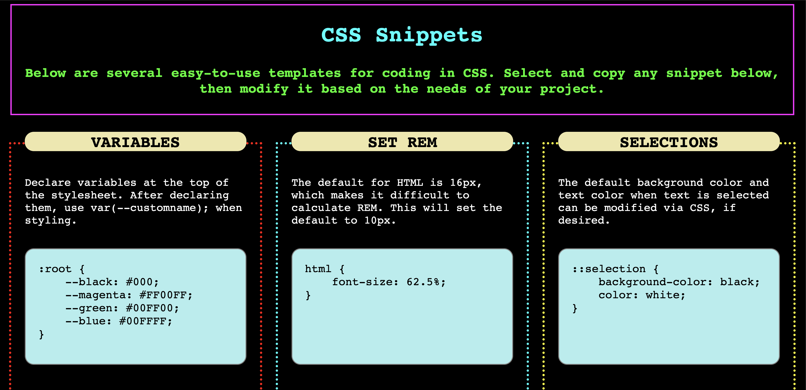

# Code Snippets Page

## Description

For this project, I built a responsive layout through custom CSS by using flex properties. The result is a grid full of useful code snippets for developers. When a user hovers over one of the code snippet boxes, the box's border and header glow. When a user clicks on one of the light blue boxes containing the code snippet, all of the code is selected so that it is easy to copy and use in another project.

This project gave me the chance to learn more about flex properties and think through advanced CSS functionality. While some of the same effects could have been accomplished via JavaScript, this project highlights some of the amazing effects that are made possible when using only CSS.

Future ideas for development include the following:

1. Additional code snippets may be added as I continue to learn about CSS.

2. Additional pages may be added that include code snippets for various programming languages.

3. Additonal CSS or JavaScript animations.

4. Links to helpful resources.

Please find the deployed application here: https://vruss14.github.io/access-code-snippets

## Installation

No installation steps are required to view this project. To view the front-end application, visit the URL above. The application's source code can be found on GitHub here: https://github.com/vruss14/access-code-snippets.

## Usage

This web application is designed for all applications.

Below is a screenshot of the desktop version of the deployed application:

## Credits

Valerie Russell designed and created this webpage.

